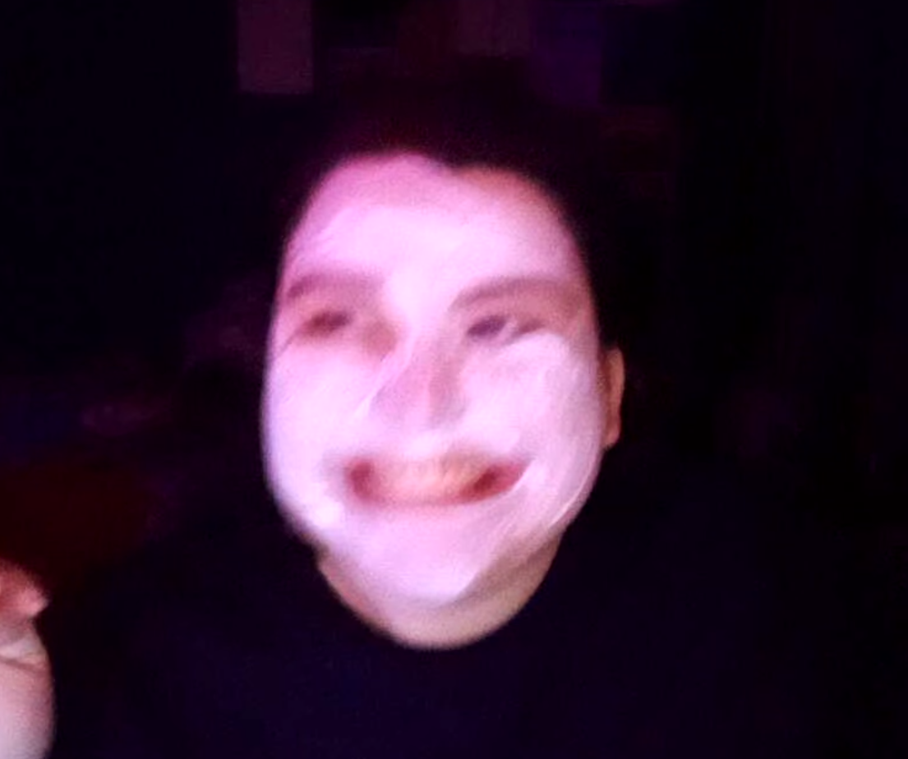
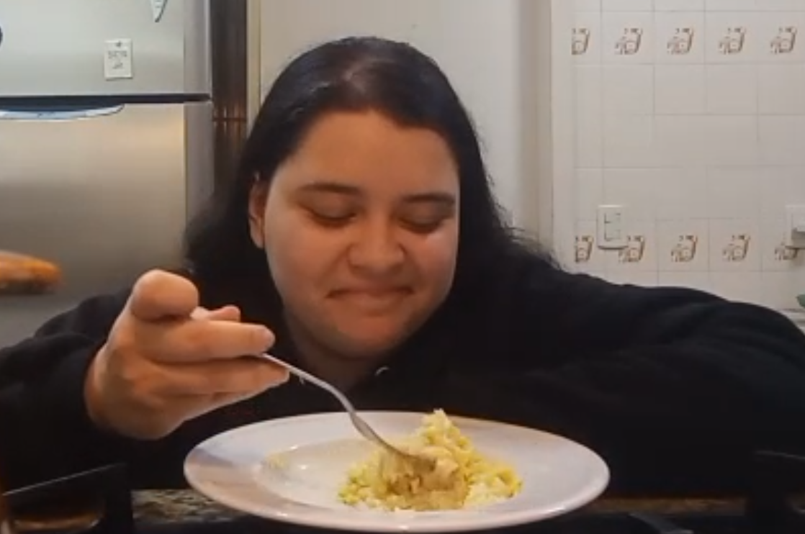
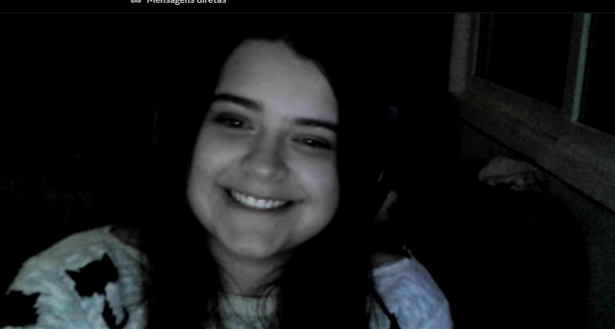

<html lang="pt-br">
<head>
<meta charset="UTF-8">
<meta name="viewport" content="width=device-width, initial-scale=1.0">
<title>Para minha pandinha ❤️</title>

</head>

<body>

<!-- INICIO -->

    <h1>Eu fiz isso pra você ❤️</h1>
    <button onclick="entrar()">Entrar</button>

<audio id="musica" loop>
  <source src="musica.mp3" type="audio/mpeg">
</audio>

<!-- INTRO -->
<h1 class="type" data-text="Para minha pandinha, minha princesa, Gabriela Alaide ❤️"></h1>

<!-- BLOCO 1 -->

<b>A maquiagem kkkkk</b>

Eu nunca vou esquecer esse dia…  
Era pra ser algo simples… e acabou virando um caos completo kkkkk.  
Sua maquiagem começou a descascar, seu sorriso travou… e mesmo assim… 
a gente não conseguia parar de rir.  
E é isso que ficou marcado pra mim. 
Não foi o erro… foi a felicidade que veio junto.  
Porque com você, até os momentos “errados” viram lembranças perfeitas.  
Se for pra viver uma vida inteira assim… 
eu quero isso pra sempre com você.

<!-- BLOCO 2 -->

<b>A viagem…</b>

Essa viagem pode ter sido só alguns dias… 
mas pra mim significou muito mais do que parece.  
Foi ali que aconteceram coisas que aproximaram a gente de um jeito diferente.  
Cada conversa, cada momento, cada pequena “peripécia”… 
foi construindo algo maior.  
E sem eu perceber… você já estava se tornando alguém essencial pra mim.

<!-- BLOCO 3 -->

<b>Seu sorriso…</b>

Esse sorriso… é você de verdade.  
E quando você sorri assim… parece que tudo fica mais leve.  
Se eu pudesse escolher uma coisa pra guardar pra sempre… 
seria você sorrindo assim.

<!-- BLOCO 4 -->

<b>A cara de nojo KKKKK</b>

Eu ainda dou risada disso kkkkk.  
Mas isso mostra o quanto a gente é real.  
Sem fingimento, sem filtro… 
e é isso que faz tudo ser tão especial.

<!-- BLOCO 5 -->

<b>A primeira vez que te vi…</b>

Ali… alguma coisa mudou.  
Minha vida começou a tomar outro rumo.  
E hoje eu sei qual era esse rumo: 
você.

    
Você virou minha paz.

    
Meu lugar favorito.

    
Minha pessoa.

    
Eu te amo nos dias bons.

    
Nos dias difíceis.

    
Em todos os momentos.

    
E eu escolheria você… sempre.

    <button class="final-btn" onclick="plotTwist()">Clique aqui 💖</button>

<!-- FINAL -->

    

    
Gabriela Alaide

</body>
</html>
